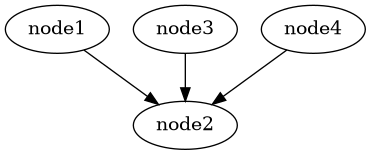
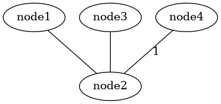

# 图

## 有向图

```plantuml
@startuml
digraph name {
    "node1" -> "node2"
    subgraph name1 {
        "node3" -> "node2"
        "node4" -> "node2"
    }
}
@enduml
```

## 无向图

```plantuml
@startuml
graph name {
    "node1" -- "node2"
    "node3" -- "node2"
    "node4" -- "node2" [label=1]
}
@enduml
```
