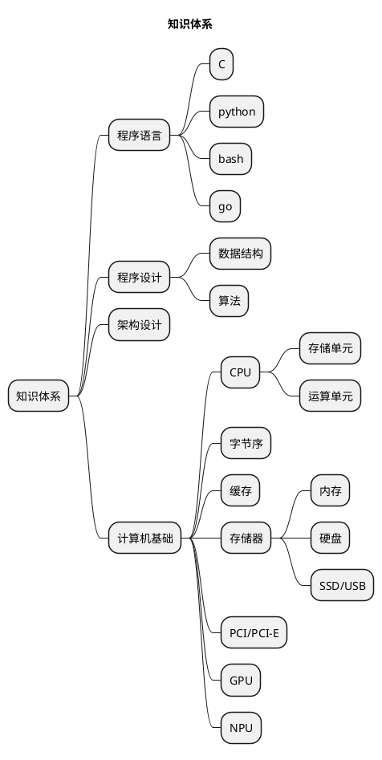
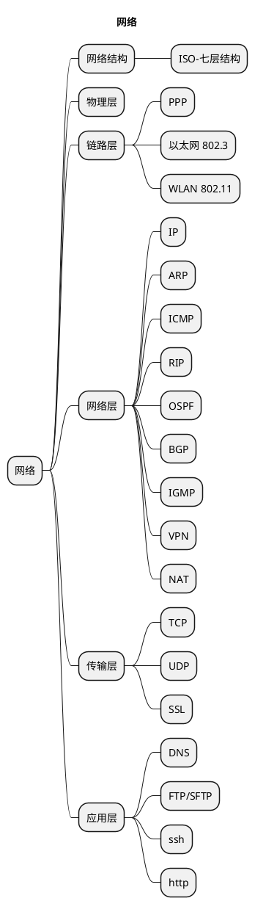

# 知识体系

```plantuml
@startmindmap
title 知识体系
* 知识体系
** 程序语言
*** C
*** python
*** bash
*** go
** 程序设计
*** 数据结构
*** 算法
** 架构设计
** 计算机基础
*** CPU
**** 存储单元
**** 运算单元
*** 字节序
*** 缓存
*** 存储器
**** 内存
**** 硬盘
**** SSD/USB
*** PCI/PCI-E
*** GPU
*** NPU

@endmindmap
```
## 网络

```plantuml
@startmindmap
title 网络
* 网络
** 网络结构
*** ISO-七层结构
** 物理层
** 链路层
*** PPP
*** 以太网 802.3
*** WLAN 802.11
** 网络层
*** IP
*** ARP
*** ICMP
*** RIP
*** OSPF
*** BGP
*** IGMP
*** VPN
*** NAT
** 传输层
*** TCP
*** UDP
*** SSL
** 应用层
*** DNS
*** FTP/SFTP
*** ssh
*** http
@endmindmap
```