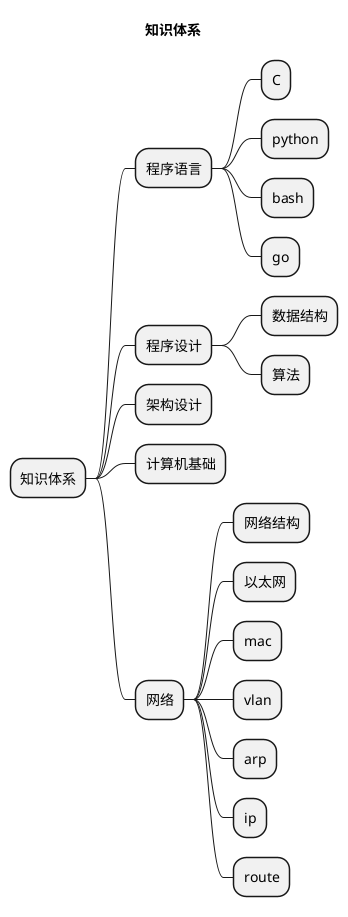

```plantuml
@startmindmap
title 知识体系
* 知识体系
** 程序语言
*** C
*** python
*** bash
*** go
** 程序设计
*** 数据结构
*** 算法
** 架构设计
** 计算机基础
** 网络
*** 网络结构
*** 以太网
*** mac
*** vlan
*** arp
*** ip
*** route
@endmindmap
```