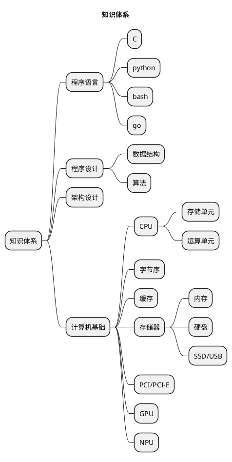

# 知识图谱

```plantuml
@startmindmap
title 知识体系
* 知识体系
** 程序语言
*** C
*** python
*** bash
*** go
** 程序设计
*** 数据结构
*** 算法
** 架构设计
** 计算机基础
*** CPU
**** 存储单元
**** 运算单元
*** 字节序
*** 缓存
*** 存储器
**** 内存
**** 硬盘
**** SSD/USB
*** PCI/PCI-E
*** GPU
*** NPU

@endmindmap
```