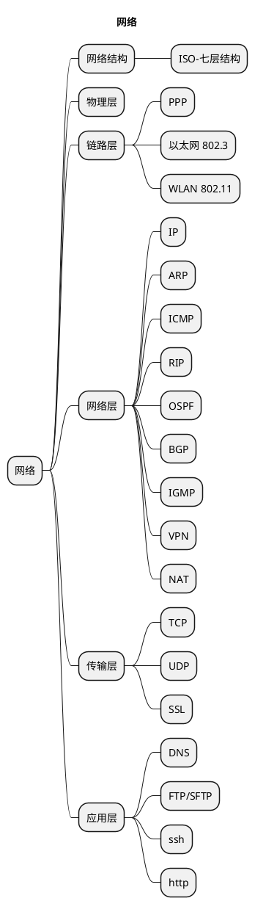

```plantuml
@startmindmap
title 网络
* 网络
** 网络结构
*** ISO-七层结构
** 物理层
** 链路层
*** PPP
*** 以太网 802.3
*** WLAN 802.11
** 网络层
*** IP
*** ARP
*** ICMP
*** RIP
*** OSPF
*** BGP
*** IGMP
*** VPN
*** NAT
** 传输层
*** TCP
*** UDP
*** SSL
** 应用层
*** DNS
*** FTP/SFTP
*** ssh
*** http
@endmindmap
```