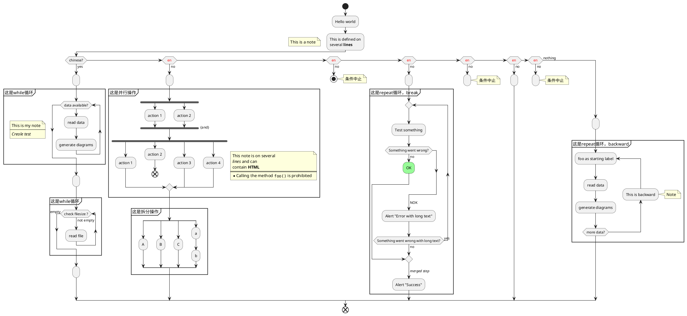

# 活动图

```plantuml
@startuml
start
:Hello world;
:This is defined on
several **lines**;
floating note left: This is a note
if (chinese?) then (yes)
: ;
partition "这是while循环" {
    note
        This is my note
        ----
        //Creole test//
    end note

while (data available?)
  :read data;
  :generate diagrams;
endwhile
}
: ;
partition "这是while循环" {
while (check filesize ?) is (not empty)
  :read file;
endwhile (empty)
}
: ;
else if (<color:red>en) then (no)
: ;
partition "这是并行操作" {
fork
  :action 1;
fork again
  :action 2;
end fork {and}
fork
  :action 1;
fork again
  :action 2;
  end
fork again
  :action 3;
fork again
  :action 4;
end merge
note right
  This note is on several
  //lines// and can
  contain <b>HTML</b>
  ====
  * Calling the method ""foo()"" is prohibited
end note
}

partition "这是拆分操作" {
split
   :A;
split again
   :B;
split again
   :C;
split again
   :a;
   :b;
end split
}
else if (<color:red>en) then (no)
stop
note right : 条件中止
else if (<color:red>en) then (no)
: ;
partition "这是repeat循环，break" {
repeat
  :Test something;
    if (Something went wrong?) then (no)
      #palegreen:OK;
      break
    endif
    ->NOK;
    :Alert "Error with long text";
repeat while (Something went wrong with long text?) is (yes) not (no)
->//merged step//;
:Alert "Success";
}
else if (<color:red>en) then (no)
: ;
kill
note right : 条件中止
else if (<color:red>en) then (no)
: ;
else if (<color:red>en) then (no)
: ;
detach
note right : 条件中止
else (nothing)
: ;
partition "这是repeat循环，backward" {
repeat :foo as starting label;
  :read data;
  :generate diagrams;
backward:This is backward;
note right: Note
repeat while (more data?)
}
endif

end
@enduml

```
