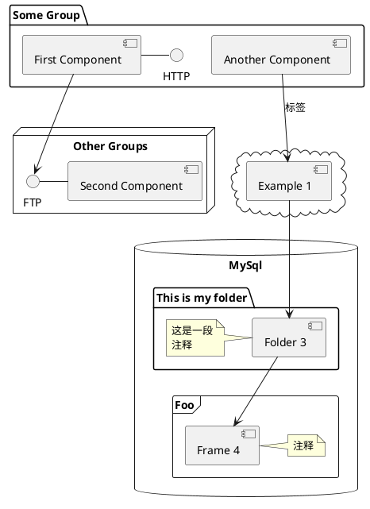

# 组件图

```plantuml
@startuml

package "Some Group" {
  HTTP - [First Component]
  [Another Component] as AC
}

node "Other Groups" {
  FTP - [Second Component]
  [First Component] --> FTP
}

cloud {
  component [Example 1] as CE
}


database "MySql" {
  folder "This is my folder" {
    [Folder 3]
    note left of [Folder 3]
    这是一段
    注释
    end note
  }
  frame "Foo" {
    [Frame 4]
    note right : 注释
  }
}


AC --> CE : 标签
CE --> [Folder 3]
[Folder 3] --> [Frame 4]

@enduml

```
