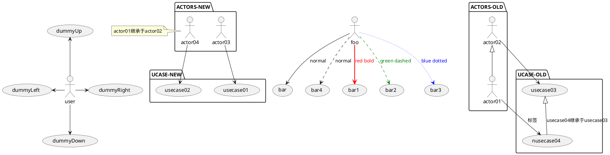

# 用例图

```plantuml
@startuml

package UCASE-NEW {
    (usecase01)
    (usecase02) as (UC2)
}
package UCASE-OLD {
    usecase usecase03
    usecase (nusecase04) as UC4
}

package ACTORS-OLD {
:actor01:
:actor02: as AC2
}

package ACTORS-NEW {
actor actor03
actor :actor04: as AC4
}

AC2 --> usecase03
:actor01: --> UC4 : 标签

AC2 <|-- :actor01:
note left : actor01继承于actor02

usecase03 <|-- UC4 : usecase04继承于usecase03

actor03 -> usecase01
AC4 --> UC2

:user: -left-> (dummyLeft)
:user: -right-> (dummyRight)
:user: -up-> (dummyUp)
:user: -down-> (dummyDown)

actor foo
foo --> (bar) : normal
foo ..> (bar4) : normal
foo --> (bar1) #line:red;line.bold;text:red  : red bold
foo --> (bar2) #green;line.dashed;text:green : green dashed
foo --> (bar3) #blue;line.dotted;text:blue   : blue dotted

@enduml
```
