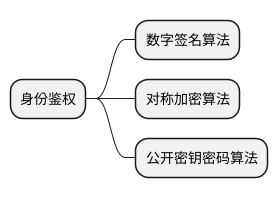

# 身份鉴权

## 对称加密算法
对称加密算法是根据Shannon理论建立的一种变换过程，该过程将一个密钥和一个数据充分混淆和置乱，使非法用户在不知密钥的情况下无法获得原始数据信息。当然一个加密算法几乎总伴随着一个对应的解密算法，并在对称密钥的参与下执行。典型的对称加密算法包括DES和AES

## 公钥密码算法
公钥密码算法需要2个密钥和2个算法：一个是公开密钥，用于对消息的加密；一个是私钥（私有密钥），用于对加密消息的解密。根据名称可以理解，公开密钥是一个能公开的密钥，而私钥只能由合法用户掌握。典型的公钥密码算法包括RSA公钥密码算法和数字签名标准DSS。

## 数字签名
数字签名实际是公钥密码的一种应用，其工作原理是，用户使用自己的私钥对某个消息进行签名，验证者使用签名者的公开密钥进行验证，这样就实现了只有拥有合法私钥的人才能产生数字签名（不可伪造性）和得到用户公钥的公众才可以进行验证（可验证性）的功能。

# 参考
[网络安全之身份认证](https://blog.csdn.net/wowotuo/article/details/82825427)

<link rel="stylesheet" type="text/css" href="./style.css" />

